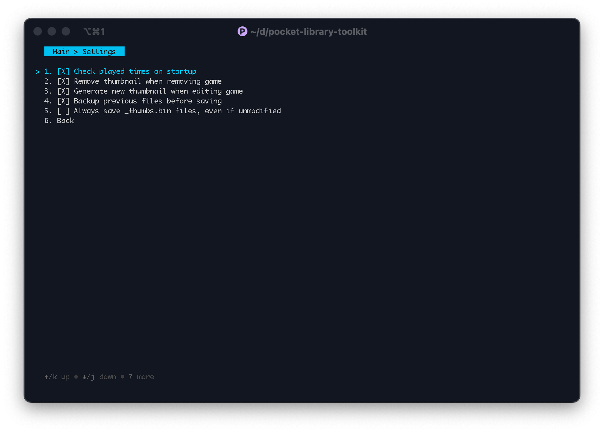

## Pocket Library Toolkit User Guide

### Installation & General Use

To install, either place `pltoolkit` in the root of your SD card & run from there or, from a terminal, run the
application & provide it with the path to your SD card's root directory.

Upon startup, the application will automatically attempt to open the list.bin, playtimes.bin, and any *_thumbs.bin files
present in the System subdirectory & load them into memory.

General keys:

* Select: `enter` or `space`
* Go back a screen: `esc`
* Force-quit without saving: `ctrl+C`

### Main Menu

Use up & down arrows to navigate and enter or space to select.

From this menu, the following options are available:

1. [**Library**](#library-menu): display actions related to the game library
2. [**Thumbnails**](#thumbnails-menu): display actions related to library thumbnails
3. [**Settings**](#settings-menu): display available config options
4. **About**: displays the application version
5. [**Save & Quit**](#save--quit): saves data to disk. See the linked section for details of what is saved & where.
6. **Quit**: quit without saving any of the changes

### Library Menu

The library menu displays actions related to the game entries in the library.
The following options are available:

1. [**Edit entry**](): displays [a list](#the-game-list) of all the games in the user library. Selecting the entry will
   displau the
   details of it for editing.
2. **Remove entry**: displays [a list](#the-game-list) of all the games in your library. Enter or space on an entry will
   remove it
   from
   the library. If [_"remove thumbnail when removing game"_](#settings-menu) is set, then the corresponding image will
   be removed from _thumbs.bin at the same time.
3. **Fix played times**: attempts a simple adjustment of the times for every game in the library. This involves removing
   approximately 4660 hours from any game whose played time is greater than 4660 hours & addresses an occasional bug
   where game times are displayed inaccurately.
4. **Back**: return to the [main menu](#main-menu)

### Thumbnails Menu

The thumbnails menu displays actions related to the thumbnails displayed when browsing the library in "Image" or "Grid"
mode. It does not affect images displayed on the game info screen.

Any options that generate new thumbnails will attempt to use the images in using the images found in
/System/Library/Images/<System Name> as their source images. If the required image is not available, then a thumbnail
will not be generated

The following options are available:

1. **Generate missing thumbnails**: compares the games in the library to the available thumbnails & attempts to generate
   any thumbnails for games that do not presently have a thumbnail
2. **Regenerate single game**: displays [a list](#the-game-list) of all the games in your library. Enter or space on an
   entry will attempt to generate a new thumbnail for the game, replacing any existing thumbnail. Useful for if you
   recently replaced the source image but don't want to delete the _thumbs.bin file & reload all the thumbnails.
3. **Regenerate full library**: attempts to generate new thumbnails for all games in the library, replacing any existing
   thumbnails
4. **Prune orphaned thumbnails**: compares the thumbnail caches to the games in the library & removes any thumbnails
   from the _thumbs.bin caches that do not have a corresponding entry in the library
5. **Generate complete system thumbnails**: generates thumbnails for all images in the system subdirectories under
   /System/Library/Images/, regardless of whether the game has an entry or not. This is mostly useful if browsing the
   system libraries under `User Service`.

   ***Important Caveat***: Generating these files may cause noticeable
   performance degradation when browsing your library (sluggish response, occasional dropped inputs) as the resulting _
   thumbs.bin files total a bit over 400MB & greatly exceed the amount of RAM the Pocket has set aside for image
   caching.
6. **Back**: return to the [main menu](#main-menu)

### Settings Menu

Displays settings currently in use by the system. Ones marked with an `X` are active.

1. **Remove thumbnail when removing game**: similar to running "prune orphaned thumbnails" immediately after
   removing a game. If this value is not set, the thumbnails for any removed games will remain in the thumbnail caches.
2. **Generate new thumbnail when editing game**: if set, editing a game will automatically generate a new thumbnail,
   overwriting any existing thumbnails. This is mostly useful for if you change the game's [CRC32 value.](#crc32)
3. **Always save _thumbs.bin files, even if unmodifier**: by default, the application only saves new copies of the _
   thumbs.bin files if it detects that the thumbnails have been modified during this session. If this setting is turned
   on it will save new copies of the files regardless of changes. Leaving this off will improve save performance for
   large libraries.
3. **Back**: return to the [main menu](#main-menu)

### Save & Quit

Writes out a new copy of list.bin & thumbs.bin, as well as any modified _thumbs.bin caches.

These files are written out to the directory `pocket-toolkit`, which is located in the current working directory. If
running off the root of the SD card, the directory will most likely be created there.

In addition, this action saves the current user config to pocket-toolkit.json, located in the application directory.

### The Game List

Used by the edit, remove, and regenerate thumbnail options. Up & down navigate the list, while left & right switch
pages.

Enter or space selects an entry and a filter is available by typing `/`.

To exit the list & return to previous menu, press `esc`

### Editing an Entry

Up & down or shift+tab & tab navigate.

#### Name

Game name that will be displayed in the library. Cannot be blank.

#### CRC32

A hexadecimal 32 bit integer. This value is used to determine which thumbnail to display in the library & corresponds to
the CRC32 of the game ROM. If blank, `0x00000000` will be used.

#### Date Added

The date & time the game was added to the library. Of the format `YYYY-MM-dd HH:mm`. Both 12 & 24 hour times are
accepted.

If blank, this value will be set to the current date & time.

#### Played

The total time the game has been played. Contains 3 parts: an hour section, indicated by `h`, a minute section (`m`),
and a seconds section (`s`). Any of these sections are optional.

If left blank, the total time played will be set to 0.